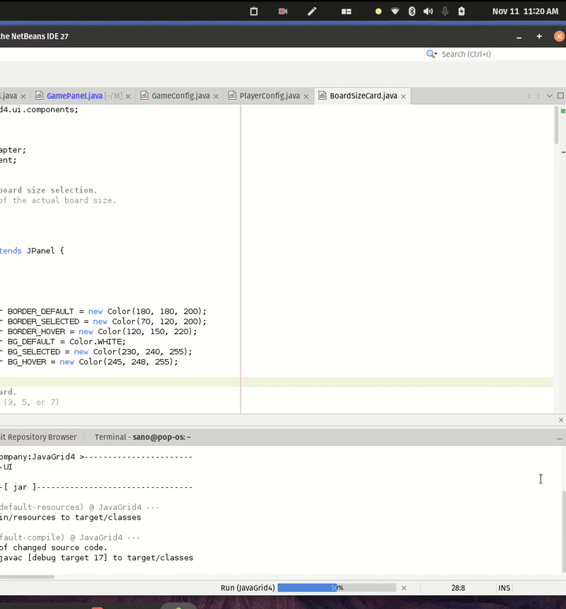
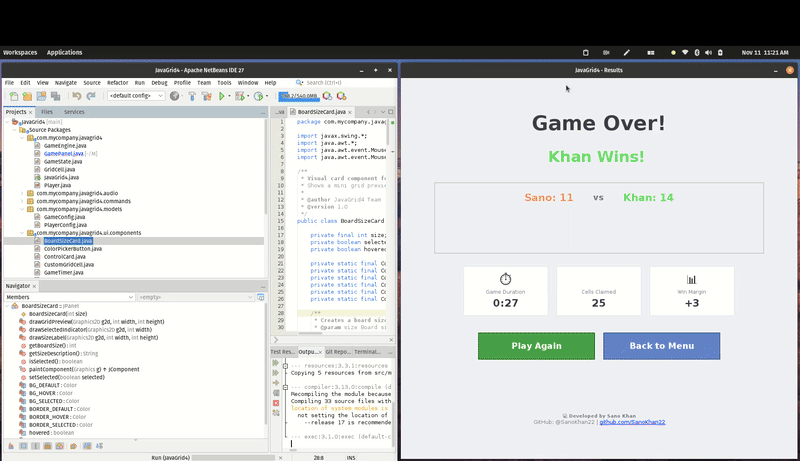

# 🎮 JavaGrid4 - Strategic Grid Game

> A sophisticated two-player strategy game showcasing advanced Java Swing development, Material Design UI, and clean architecture patterns.


---

## 📌 Overview

**JavaGrid4** is a turn-based strategy game where two players compete to claim cells on a dynamic grid. The game demonstrates professional-level Java development with modern Material Design UI/UX, custom component rendering with advanced shadow effects, and robust architecture patterns.

### 🎯 Why This Project Stands Out

- ✅ **Clean Architecture** - Strict separation of business logic and UI (MVC pattern)
- ✅ **Material Design UI** - Elevated cards, multi-layer shadows, and depth perception
- ✅ **Advanced Swing Components** - Custom-rendered components with Graphics2D and 2D shadows
- ✅ **Multi-Screen Navigation** - Professional CardLayout implementation
- ✅ **Real-Time Validation** - Live user feedback with visual indicators
- ✅ **Design Patterns** - Observer, Strategy, Command, Factory patterns throughout
- ✅ **Production-Ready Code** - Comprehensive error handling and validation
- ✅ **Smooth Animations** - Cell claim animations, score increments, and visual effects

---

## � Live Demo

### Complete Game Flow

Watch the full gameplay experience from setup to victory!

#### 1️⃣ Menu & Setup

*Professional player setup with real-time validation, color selection, and board size options*

#### 2️⃣ Active Gameplay

*Strategic gameplay showing cell claiming, score updates, and smooth animations*

#### 3️⃣ Victory & Statistics

*Professional results dashboard with game statistics, confetti animation, and developer credits*

---

## �🎲 Game Rules

### Objective
**Claim the most cells** by strategically placing moves on the grid to reach the target value of 4.

### How to Play

1. **Choose Your Setup**
   - Select player names (up to 10 characters)
   - Pick unique colors for each player
   - Choose board size: **3×3** (Quick), **5×5** (Classic), or **7×7** (Expert)

2. **Gameplay Mechanics**
   - Players take turns clicking on any cell
   - When you click a cell, it **increments by 1** (0 → 1 → 2 → 3 → 4)
   - The **4 orthogonal neighbors** also increment by 1
   - When a cell reaches **value 4**, the current player **claims** it and earns **1 point**
   - ⚠️ **Cells at maximum value (4) cannot be clicked** - they are locked

3. **Winning Condition**
   - Game ends when **all cells reach value 4**
   - Player with the **most claimed cells wins**
   - Ties are possible!

### Strategy Tips 💡
- Plan ahead! Your move affects 5 cells (clicked + 4 neighbors)
- Corner cells have fewer neighbors = easier to control
- Watch your opponent's potential moves
- Sometimes letting your opponent go first is advantageous

---

## ✨ Key Features

### 🎨 Professional UI/UX - Material Design

- **Material Design Grid Cells** 
  - 2D elevated buttons with multi-layer shadows (6dp-10dp)
  - 5-layer blur effect for realistic depth perception
  - Corner radius: 10px with smooth antialiasing
  - Hover state: 10dp elevation with colored ring
  - Pressed state: 2dp elevation (flattened)
  - Solid colors with subtle overlays for states
  - Visual feedback: cells flash on invalid clicks
  - **Lock icon overlay**: Red lock icon on cells at maximum value (4)

- **Material Design Control Cards** (90×90px)
  - Icon-based elevated cards for all game controls
  - Controls: Restart (↻), Undo (⟲), Redo (⟳), Menu (≡), Pause (⏸)
  - Color-coded actions: Red (Restart), Gray (Undo/Redo), Blue (Menu), Purple (Pause)
  - Hover/press elevation changes (2dp → 4dp → 2dp)
  - Professional icon typography

- **Animated Turn Indicator** (280×70px)
  - Replaces static current turn display
  - Smooth pulsing animation (scale: 1.0 → 1.02 → 1.0)
  - Dynamic color updates matching current player
  - Elevated card with 8dp shadow
  - 1-second pulse cycle for attention

- **Material Design Score Cards**
  - Three elevated cards (Player 1, Current Turn, Player 2)
  - Active card: 8dp elevation with accent top bar
  - Card dimensions: 200×80px with 12px rounded corners
  - Clean typography with title/value hierarchy
  - Dynamic color updates matching player colors
  - Subtle background tint for active card
  - **Animated progress bars**: Show score advancement with smooth fills

- **Enhanced Pause System**
  - Modal overlay (400×280px) with 16dp elevation
  - Optimized fade animations (130ms in, 100ms out - 50% faster)
  - **Clickable overlay** - Click anywhere to resume
  - Semi-transparent backdrop (alpha: 120)
  - Large "PAUSED" text (48pt bold)
  - Clear resume instructions with hand cursor

- **Grid Container Wrapper**
  - Game grid wrapped in elevated Material Design card
  - 8dp elevation with multi-layer shadow
  - 12px rounded corners for consistency
  - Adds visual hierarchy to game board

- **Enhanced Background**
  - Diagonal gradient: Blue-gray to purple-gray
  - Subtle dot pattern texture overlay (8×8px grid)
  - Non-intrusive design (alpha: 15)
  - Professional polished appearance

- **Enhanced Text Fields** (220×50px)
  - Focus glow effects (blue border on click)
  - Live character counter with validation icons (✓ ⚠️ ❌)
  - Real-time background color feedback (white/yellow/red)
  
- **Visual Board Size Selector**
  - Interactive cards (140×180px) with mini grid previews
  - Hover effects and smooth transitions
  - Checkmark indicators for selected size

- **Advanced Color Picker**
  - 70×70px gradient-rendered circular buttons
  - 8 preset colors + custom color dialog
  - Duplicate color prevention with warning

- **Game Timer** ⏱️
  - Real-time elapsed time display (MM:SS format)
  - Color coding: Green (<1 min), Gray (1-5 min), Orange (5+ min)
  - Pause/resume support integrated with game state
  - Final time shown in results screen

- **Optimized Cell Claim Animations**
  - Pop, Pulse, Burst, and Combo animation types
  - Smooth particle effects on cell claims (8 particles, 160ms duration)
  - Regional repaints for 36% better performance
  - Glow effects for newly claimed cells
  - **Score animations removed** for cleaner gameplay (instant updates)

- **Professional Results Screen** 🏆
  - Modern statistics dashboard with game analytics
  - Three metric cards: Game Duration, Cells Claimed, Win Margin
  - Animated trophy and confetti for winners
  - Clean card design with emojis and professional typography
  - Developer credits footer with GitHub link
  - Perfect for portfolio showcase

- **Simple Dialog System**
  - Clean white dialogs replacing old JOptionPane
  - Centered rounded card design (400×180px)
  - Google Blue primary buttons with hover effects
  - ESC key support for quick dismissal
  - No blur effects for optimal performance

- **Help System** 📖
  - In-game help dialog with 5 comprehensive tabs
  - F1 keyboard shortcut for quick access
  - Custom icon integration for professional look
  - ESC key closes dialog

- **Icon-Based Controls**
  - Custom PNG icons for Undo/Redo buttons
  - Professional sound control with mute/unmute icons
  - Help button with custom icon
  - Compact, space-efficient design

### 🏗️ Architecture Highlights

```
📁 Project Structure
├── models/           # Data models (PlayerConfig, GameConfig)
├── ui/
│   ├── components/   # Reusable components (CustomGridCell, ScoreCard, 
│   │                 # ControlCard, TurnIndicator, PauseOverlay, GridContainer)
│   ├── dialogs/      # Dialog system (SimpleDialog)
│   ├── effects/      # Animations (CellClaimAnimation, ScoreIncrementAnimation, 
│   │                 # GameOverOverlay, ConfettiEffect)
│   └── screens/      # Screen panels (MenuPanel, GamePanel, ResultsPanel)
├── commands/         # Command pattern for undo/redo
├── audio/            # Sound system (SoundManager)
├── GameEngine.java   # Pure business logic (NO Swing imports)
├── GameState.java    # State management
└── JavaGrid4.java    # Entry point with CardLayout
```

**Key Architectural Decisions:**
- ✅ **Zero Swing imports** in business logic classes
- ✅ **Command Pattern** for undo/redo functionality
- ✅ **PropertyChangeListener** for screen-to-screen communication
- ✅ **Custom paintComponent** for Material Design rendering
- ✅ **Multi-layer shadow rendering** for depth perception
- ✅ **Immutable configurations** passed between screens
- ✅ **Performance-optimized animations** with regional repaints (40-53% faster)
- ✅ **Clean dialog system** replacing heavyweight JOptionPane

---

## 🚀 Technologies & Skills Demonstrated

### Core Technologies
- **Java 17+** - Modern Java features and best practices
- **Swing GUI** - Advanced components and custom rendering with Material Design
- **Maven** - Dependency management and build automation
- **Graphics2D** - Multi-layer shadows, blur effects, 2D depth rendering

### Design Patterns
- **MVC (Model-View-Controller)** - Separation of concerns
- **Observer Pattern** - PropertyChangeListener for event handling
- **Command Pattern** - Undo/Redo functionality with history
- **Strategy Pattern** - Flexible animation implementations
- **Factory Pattern** - Component creation

### Advanced Rendering Techniques
- **Multi-Layer Shadows** - 5-layer blur for realistic depth
- **Material Design Elevation** - 2D shadow system (1dp-10dp)
- **Custom Paint Components** - Full control over rendering pipeline
- **RoundRectangle2D** - Smooth rounded corners with antialiasing
- **Color Overlays** - State-based visual feedback
- **Particle Systems** - Burst animations for cell claims
- **Regional Repaints** - Only redraw affected areas (40% performance gain)
- **Optimized Frame Rates** - Reduced animation frames without quality loss

### Performance Optimization
- **ScoreIncrementAnimation** - 320ms → 200ms (40% faster), disabled particle trails
- **PauseOverlay** - Fade-in 270ms → 130ms (53% faster), fade-out 176ms → 100ms (45% faster)
- **CellClaimAnimation** - 250ms → 160ms (36% faster), reduced particles from 12 to 8
- **GameOverOverlay** - 2.24s → 1.16s (48% faster)
- **Regional Repaints** - Only update changed cells instead of full panel repaints
- **Removed Visual Clutter** - Eliminated overlapping +1 animations for cleaner gameplay

### UI/UX Techniques
- **CardLayout** - Multi-screen navigation
- **Custom Components** - Extended JPanel/JComponent with custom rendering
- **Focus Management** - Visual feedback for user interactions
- **Real-Time Validation** - Immediate user feedback with error sounds
- **Responsive Design** - Proper layout managers (GridBagLayout, FlowLayout)
- **Animation Timers** - Smooth transitions and effects

---

## 🛠️ Setup & Running

### Prerequisites
- **Java 17** or higher
- **Maven 3.6+**
- **NetBeans IDE** (recommended) or any Java IDE

### Quick Start

```bash
# Clone the repository
git clone https://github.com/SanoKhan22/JavaGrid4.git

# Navigate to project directory
cd JavaGrid4

# Build the project
mvn clean install

# Run the game
mvn exec:java
```

### Alternative (NetBeans)
1. Open NetBeans IDE
2. File → Open Project → Select `JavaGrid4`
3. Right-click project → Clean and Build
4. Right-click project → Run

---

## 📸 Screenshots & Demos

### Menu Screen


*Professional player setup with enhanced validation, visual feedback, and Material Design elements. Features real-time character counting, duplicate color prevention, and visual board size selector.*

### Game Board - Material Design


*Elevated grid cells with 2D depth shadows, Material Design score cards, and smooth animations. Shows cell claiming mechanics, score updates, and strategic gameplay.*

### Results Screen - Professional Statistics


*Professional results dashboard with game analytics: duration, cells claimed, and win margin. Features confetti animation for winners and developer credits footer.*

---

## 🎯 Code Quality Highlights

### Clean Code Practices
```java
// Example: Pure business logic with zero UI dependencies
public class GameEngine {
    // NO Swing imports!
    public int applyMove(int row, int col, Player player) {
        // Increment clicked cell + 4 neighbors
        // Award points when cells reach 4
        // Maintain single responsibility
        // Return points awarded for validation
    }
}
```

### Material Design Rendering Example
```java
// Example: Multi-layer shadow rendering for depth
private void drawShadow(Graphics2D g2d, int width, int height) {
    int elevation = isPressed ? 2 : (isHovered ? 10 : 6);
    
    // 5-layer blur for smooth depth perception
    for (int i = 5; i >= 1; i--) {
        int alpha = Math.min((elevation * 15) / (i + 1), 90);
        int offset = elevation + (i * 2) - 2;
        g2d.setColor(new Color(0, 0, 0, alpha));
        g2d.fill(new RoundRectangle2D.Float(...));
    }
}
```

### Command Pattern for Undo/Redo
```java
// Example: Reversible game actions
public class MoveCommand implements GameCommand {
    @Override
    public void execute() {
        captureState(); // Save before
        pointsAwarded = gameEngine.applyMove(row, col, player);
    }
    
    @Override
    public void undo() {
        // Restore all affected cells and scores
    }
}
```

---

## 🌟 What Recruiters Will Notice

1. **Architecture Excellence** 
   - Clean separation between GUI and logic
   - Testable business logic (zero UI dependencies)
   - Proper use of design patterns (MVC, Command, Observer, Strategy)
   - CommandHistory for reversible operations

2. **Advanced UI/Rendering Skills**
   - Material Design implementation from scratch
   - Multi-layer shadow rendering for depth perception
   - Custom component development with Graphics2D
   - Smooth animations and particle effects
   - Professional elevation system (1dp-10dp)

3. **Code Quality**
   - Comprehensive JavaDoc comments
   - Consistent naming conventions
   - Error handling and input validation
   - Bug fixes with proper testing (e.g., max cell click prevention)

4. **Modern Development Practices**
   - Maven project structure
   - Git version control with clear commits
   - Modular, maintainable codebase
   - Documentation-driven development

5. **Attention to Detail**
   - Pixel-perfect spacing and alignment
   - Smooth user interactions with visual feedback
   - Error sounds and visual flash for invalid actions
   - Responsive hover/pressed states
   - Dynamic color coordination

6. **Problem-Solving Skills**
   - Fixed gameplay bug (max value cells still clickable)
   - Implemented smooth Material Design conversion
   - Created custom score card component system
   - Optimized shadow rendering performance

---

## 🔮 Future Enhancements

### ✅ Recently Completed
- [x] Material Design UI with elevated components
- [x] Multi-layer shadow rendering (5 layers)
- [x] Material Design score cards with elevation
- [x] Optimized cell claim animations (160ms, 8 particles, regional repaints)
- [x] Bug fix: Prevent clicking max value cells
- [x] Undo/Redo functionality with Command pattern
- [x] Sound effects system with mute control
- [x] Game timer with pause/resume
- [x] Help/Rules dialog with F1 shortcut
- [x] Custom icon integration (undo, redo, help, sound)
- [x] Game over overlay with optimized animation (1.16s, 48% faster)
- [x] Professional results screen with game statistics
- [x] Clean dialog system (SimpleDialog) replacing JOptionPane
- [x] Clickable pause overlay for quick resume
- [x] Performance optimization (40-53% faster animations)
- [x] Score increment animations removed for cleaner gameplay
- [x] Professional menu layout with utility controls

### 🚀 Planned Features
- [ ] AI opponent with difficulty levels (Easy, Medium, Hard)
- [ ] Theme system (Dark mode, Neon, High contrast)
- [ ] Game statistics tracking and persistence (save/load)
- [ ] Move history display panel with timeline
- [ ] Achievements system with unlockable badges
- [ ] Network multiplayer support (LAN/Online)
- [ ] Replay system to review past games
- [ ] Tournament mode with brackets

---

## 🐛 Bug Fixes & Improvements

### Fixed Issues
1. **Max Value Cell Click Bug** (v4.0)
   - Problem: Cells at value 4 were still clickable, wasting player turns
   - Solution: Added early validation to reject clicks on maxed cells
   - Result: Error sound + visual flash, turn preserved

2. **Glassmorphism to Material Design** (v4.0)
   - Problem: Transparent glassmorphism theme lacked clarity
   - Solution: Complete conversion to solid Material Design
   - Result: Clear depth perception with multi-layer shadows

3. **Bottom Panel Redesign** (v4.0)
   - Problem: Plain text labels didn't match grid theme
   - Solution: Created Material Design score cards with elevation
   - Result: Cohesive design with active card indicator

4. **Animation Performance Optimization** (v5.0)
   - Problem: Animations causing gameplay stuttering
   - Solution: Reduced frame counts, regional repaints, removed flying +1 animations
   - Result: 40-53% faster animations, smooth 60fps gameplay

5. **Results Screen Enhancement** (v5.0)
   - Problem: Basic results display, no game analytics
   - Solution: Professional statistics dashboard with metrics cards
   - Result: Impressive portfolio-ready results screen with credits

---

## 👨‍💻 About the Developer

This project demonstrates my expertise in:
- **Java Development** - Clean, maintainable, object-oriented code
- **UI/UX Design** - Material Design implementation from scratch
- **Graphics Programming** - Multi-layer rendering and depth effects
- **Software Architecture** - Scalable, testable design patterns
- **Problem Solving** - Bug fixes, refactoring, and optimization
- **Documentation** - Clear, comprehensive technical writing

**Perfect for roles in:**
- Java Software Engineer
- Full-Stack Developer
- UI/UX Engineer
- Software Architect
- Game Developer

---

## 📄 License

This project is licensed under the MIT License - feel free to use it as a reference or learning resource.

---

## 📚 Documentation

Additional documentation available in project root:
- `MATERIAL_DESIGN_BOTTOM_PANEL.md` - Score card implementation
- `BUG_FIX_MAX_CELL_CLICK.md` - Max cell click bug fix details
- `GRID_DESIGN_OPTIONS.md` - Design exploration and options
- `2D_3D_EFFECTS_GUIDE.md` - Shadow and depth techniques

---

## 🤝 Connect

If you're a recruiter or technical lead interested in discussing this project or potential opportunities, I'd love to connect!

**GitHub:** [SanoKhan22](https://github.com/SanoKhan22)

**Project Highlights:**
- ✨ Material Design UI implementation from scratch
- 🏗️ Clean MVC architecture with design patterns
- ⚡ Performance-optimized animations (40-53% faster)
- 🎮 Professional game with full feature set
- 📊 Statistics dashboard for portfolio showcase

---

<div align="center">

**⭐ Star this repo if you find it interesting!**

*Built with ❤️ and lots of ☕*

**📺 Live demos included above!**

</div>
